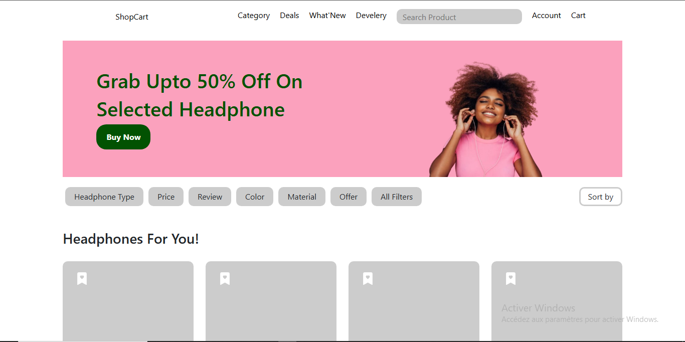
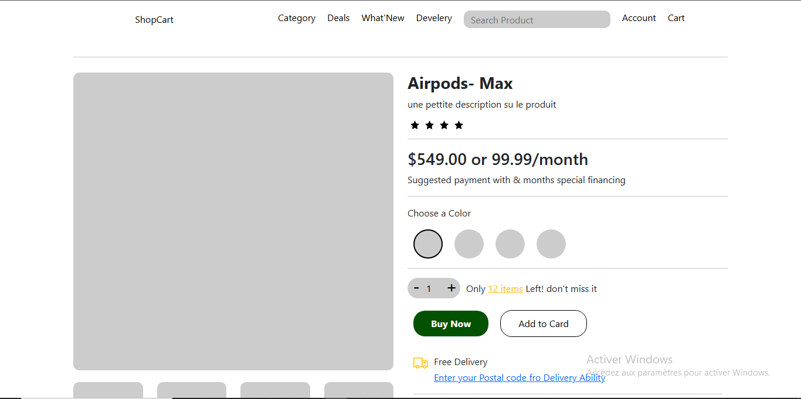
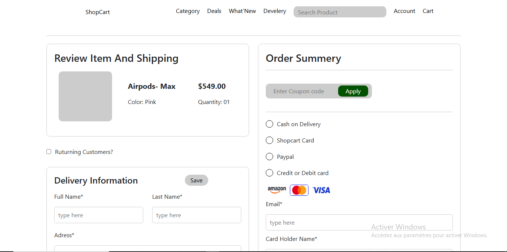
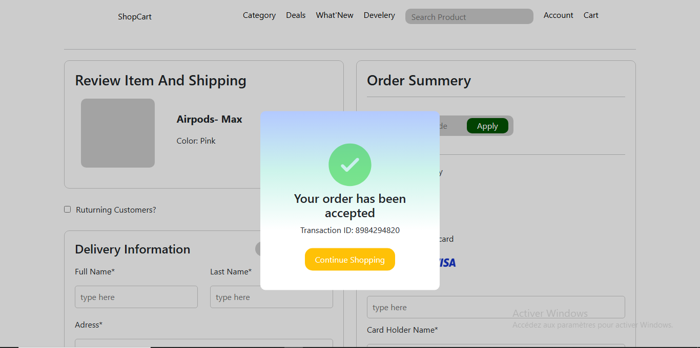

# 🛒 Projet E-commerce React

Bienvenue dans ce projet de boutique en ligne développé avec **React.js**. L'application propose une navigation fluide, des composants réutilisables et une structure moderne basée sur `react-router-dom`.

## 🚀 Fonctionnalités principales

- **Navigation dynamique** avec `react-router-dom`
- **Affichage de produits** (Articles, Catégories, Détails)
- **Système de filtre** pour une recherche personnalisée
- **Panier d’achat** interactif
- **Pages d’authentification** (Connexion et Inscription)
- **Processus de paiement simplifié**
- **Pagination** des articles
- **Responsive Design**

## 📁 Structure des routes

L'application utilise un routeur central (`createBrowserRouter`) qui gère les pages suivantes :

| Route            | Composants rendus                                                                 |
|------------------|-----------------------------------------------------------------------------------|
| `/`              | `Navbar`, `Wallpaper`, `Filter`, `Article` (x3), `Pagination`, `Footer`          |
| `/showarticle`   | `ShowArticle`, `MoreDetails`, `Article` (x2), `Pagination`                       |
| `/checkout`      | `SpaceCheckout`                                                                  |
| `/login`         | `Login`                                                                          |
| `/singin`        | `Singin`                                                                         |
| `/category`      | `Headcategory`, `Article` triés par type, `Pagination`, `Footer`                 |
| `/cart`          | `Cart`                                                                           |

## 🧱 Composants utilisés

- `Navbar` : Barre de navigation principale
- `Wallpaper` : Image d’accueil
- `Filter` : Filtres pour la recherche de produits
- `Article` : Carte de produit
- `Pagination` : Gestion de la navigation entre pages
- `Footer` : Pied de page
- `ShowArticle` : Affichage individuel d’un article
- `MoreDetails` : Détails supplémentaires sur le produit
- `SpaceCheckout` : Interface de paiement
- `Login` / `Singin` : Connexion et inscription des utilisateurs
- `Headcategory` : En-tête des catégories
- `Cart` : Panier d'achat

## 🛠️ Installation et lancement

1. Clone le projet :
   ```bash
   git clone https://github.com/ton-utilisateur/ton-projet-ecommerce.git
   cd ton-projet-ecommerce
   ```

2. Installe les dépendances :
   ```bash
   npm install
   ```

3. Lance le serveur de développement :
   ```bash
   npm run dev
   ```

## 📦 Dépendances principales

- `react`
- `react-dom`
- `react-router-dom`
- `vite` (ou autre outil de build si utilisé)

## 📸 Aperçu






## 🧑‍💻 Auteur

Développé par **OTH christian**  
💼 Passionné par le développement web et le e-commerce.